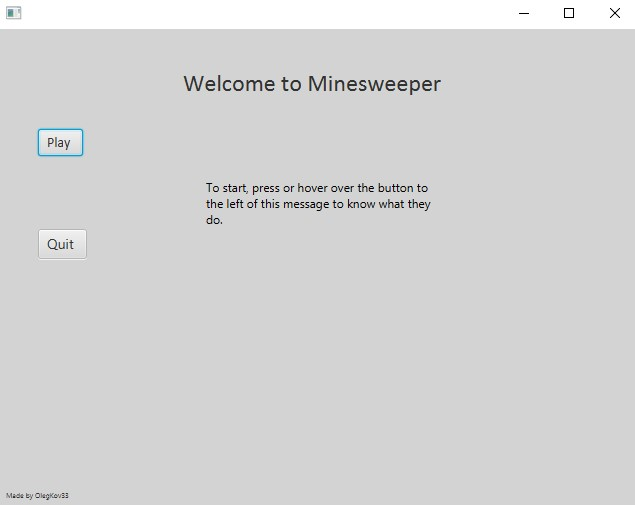
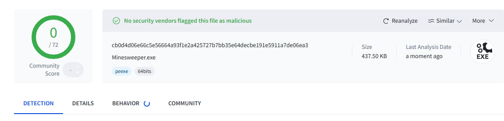
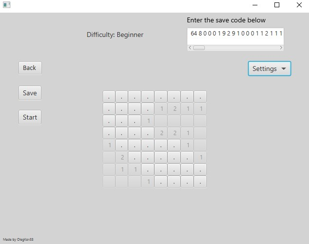

# Minesweeper
Simple minesweeper game with 3 game modes and the ability to load a saved game.
> [!NOTE]
> If you simply want to play the game, please look no further than the **Instructions on how to play the game**

### Instructions on how to play the game:
1) Press on the text >>> [Minesweeper.rar](Minesweeper.rar)
2) Press **Ctrl + Shift + S** on your keyboard or navigate to a button with [. . .], near the "Go to file" search bar
3) Extract the jar file, navigate to **Minesweeper.exe** and enjoy.

* **If you get a Windows amber warning, don't worry, the game is 100% safe!**

> [!IMPORTANT]
> The following section is dedicated towards developers
### Developer's notes
The game was created with the help of Java 21.0.5, JavaFX SDK 21.0.7, JavaFX 21.0.7 jmods, Apache Maven 3.9.10, WiX 3.14.1, Visual Studio Code and Scene Builder. Additionally, generative AI such as **ChatGPT** and **DeepSeek** were used due to a lack of knowledge on how to use the tools to achieve the .exe file format.

The previous version of Minesweeper was created using Java 17 and JavaFX SDK 13, as well as had several problems and bugs. 
1. The program loaded the game's field in a - x, y format (0, 0), (0, 1), (0, 2)... Resulting in a game being displayed in portrait rather than landscape, causing problems when opening cells in the Expert (30 x 16) mode.
2. If the button (start) is pressed multiple times, multiple fields are created and overlayed over one another.
3. The game was created using a 2D whereas the JavaFX element accepted a 1D array, which added a lot of unnecessary complexity.

Currently, the game has an ongoing problem where the buttons don't display the flags or mines upon winning or losing the game, and instead show (...). However, upon opening the game in full-screen windowed view, everything is visible.
